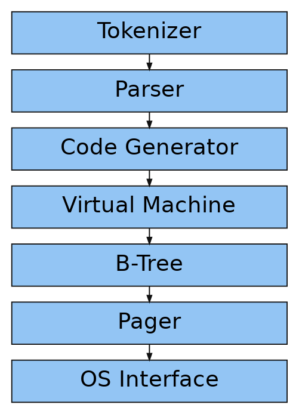

# SQLite Go

SQLiteのような小さなデータベースをGoで段階的に実装する学習用プロジェクトです。

現在は、1ファイルのDBに対して以下を扱えます。

- 対話形式のREPL
- `CREATE TABLE` による単一テーブルのスキーマ定義
- `insert` による1行追加
- `select` による全件取得
- `select <id>` による主キー検索
- B-Treeへのキー順保存、leaf/internal nodeの分割
- DBファイルへのレコードとスキーマの永続化

## 必要なもの

- Go

```bash
go version
```

## 実行方法

プロジェクトのルートディレクトリでDBファイル名を指定して起動します。

```bash
go run . test.db
```

起動すると `db >` プロンプトが表示されます。終了する場合は `.exit` を入力します。

```text
db > .exit
```

実行ファイルを作る場合は以下を使います。

```bash
go build -buildvcs=false -o sqlite-go .
./sqlite-go test.db
```

## 使い方

### CREATE TABLE

空のテーブルに対してカラム定義を設定します。
現時点では `id` カラムを `INTEGER` として含める必要があり、この `id` をB-Treeのキーとして使います。

対応している型:

- `INTEGER`
- `TEXT`
- `REAL`

```text
db > create table people (id integer, name text, height real, weight real)
Executed.
db > insert 1 Alice 165.2 54.3
Executed.
db > insert 2 Bob 172.4 68.1
Executed.
db > select
(1, Alice, 165.2, 54.3)
(2, Bob, 172.4, 68.1)
Executed.
db >
```

制約:

- 既にレコードがあるテーブルに対する `create table` は拒否します。
- スキーマ定義はDBファイルのメタデータページへ保存します。
- 1行のサイズが現在のセル値領域である `ROW_SIZE` を超えるスキーマは拒否します。

### INSERT

`insert` は、現在のスキーマのカラム順に値を受け取ります。

デフォルトスキーマ:

```text
create table users (id INTEGER, username TEXT, email TEXT)
```

```text
db > insert 1 alice alice@example.com
Executed.
db >
```

主な制約:

- 主キー `id` は0以上の整数
- デフォルトスキーマの `username` は32文字以内
- デフォルトスキーマの `email` は255文字以内
- 同じ `id` は重複キーとして拒否

### SELECT

`select` は全レコードを主キー順に表示します。

```text
db > insert 1 alice alice@example.com
Executed.
db > insert 2 bob bob@example.com
Executed.
db > select
(1, alice, alice@example.com)
(2, bob, bob@example.com)
Executed.
db >
```

`select <id>` は指定したIDのレコードだけを表示します。

```text
db > select 2
(2, bob, bob@example.com)
Executed.
db >
```

## メタコマンド

| コマンド | 説明 |
| --- | --- |
| `.exit` | DBを閉じて終了する |
| `.schema` | 現在のテーブルスキーマを `create table` 形式で表示する |
| `.constants` | ページ・ノード・セルのレイアウト定数を表示する |
| `.btree` | 現在のB-Tree構造を表示する |

例:

```text
db > .schema
create table users (id INTEGER, username TEXT, email TEXT)
db > .btree
Tree:
- leaf (size 2)
  - 1
  - 2
db >
```

## 永続化

同じDBファイルを指定して再起動すると、前回保存したスキーマとレコードを読み込めます。

```text
$ go run . test.db
db > create table people (id integer, name text, height real, weight real)
Executed.
db > insert 1 Alice 165.2 54.3
Executed.
db > .exit

$ go run . test.db
db > .schema
create table people (id integer, name text, height real, weight real)
db > select
(1, Alice, 165.2, 54.3)
Executed.
db > .exit
```

新しいDBファイルでは、page 0をメタデータページ、page 1をB-Tree rootとして使います。
古いDBファイルはpage 0をB-Tree rootとして扱う形式も読み込めるようにしています。

## エラー例

```text
db > insert 1 alice
Syntax error. Could not parse statement.
db > insert -1 cstack foo@bar.com
Primary key must be positive.
db > insert 1 user1 person1@example.com
Executed.
db > insert 1 user1 person1@example.com
Error: Duplicate key.
db > .unknown
Unrecognized command '.unknown'.
db > hello
Unrecognized keyword at start of 'hello'.
db >
```

## 実装メモ

### B-Tree

- leaf node内ではIDをキーとして二分探索し、キー順になる位置へ挿入します。
- root leaf node、子leaf node、internal nodeの分割に対応しています。
- internal nodeは再帰的に検索できます。
- leaf nodeには右隣leaf nodeへの `next_leaf` を持たせ、`select` で複数leaf nodeをまたいで全件走査します。
- leaf node split後の親internal node更新も実装しています。

### 型システム

SQLite風の型アフィニティを `schema.go` に実装しています。

| 型名の判定 | affinity |
| --- | --- |
| `INT` を含む | `INTEGER` |
| `CHAR` / `CLOB` / `TEXT` を含む | `TEXT` |
| `BLOB` または型指定なし | `BLOB` |
| `REAL` / `FLOA` / `DOUB` を含む | `REAL` |
| それ以外 | `NUMERIC` |

BooleanやDate/Time専用型は持たず、SQLite同様に `NUMERIC` affinityとして扱います。
保存形式はまだ固定長Rowですが、カラムオフセットとサイズはスキーマから計算する `RowLayout` を使います。

### enum相当の表現

GoにはC言語の `enum` と同じ構文はありません。
このプロジェクトでは `ExitCode`、`PrepareResult`、`ExecuteResult` などを独自型と `const` / `iota` で表現しています。

## ファイル構成

| ファイル | 役割 |
| --- | --- |
| `main.go` | エントリーポイント |
| `repl.go` | プロンプト表示と入力ループ |
| `meta.go` | メタコマンド |
| `statement.go` | `create table` / `insert` / `select` のパースと実行 |
| `schema.go` | 型システムとスキーマ定義 |
| `row.go` | Rowのシリアライズと表示 |
| `database_metadata.go` | DBファイルに保存するスキーマメタデータ |
| `pager.go` | DBファイルとページキャッシュ |
| `node.go` | B-Treeノードのレイアウトと表示 |
| `cursor.go` | B-Tree上の探索位置と走査 |
| `btree.go` | leaf/internal nodeの挿入と分割 |
| `constants.go` | 定数とenum相当の型 |
| `types.go` | 主要な構造体 |

## テスト

```bash
go test ./...
```

Goのビルドキャッシュへ書き込めない環境では、`GOCACHE` を `/tmp` 配下に向けます。

```bash
GOCACHE=/tmp/go-build go test ./...
```

## 段階的な拡張メモ

固定長Rowと単一主キーB-Treeの前提を外していくため、以下の順で小さく進めます。

1. 完了: `id` 固定をやめて、`PrimaryKeyColumn()` を常に使う。
2. 完了: Rowの値取得・キー取得をスキーマベースに整理する。
3. 完了: Rowシリアライズを可変長化する。
4. leaf nodeセルを可変長化する。
5. その後に複合主キー、NULL、DEFAULT、CHECK、インデックスへ進む。

## 今後の拡張案

- 条件付きselect: `select where id = ...` のようなSQL風の条件式を扱う。
- 更新処理: `update <id> ...` を追加し、既存レコードを書き換える。
- 削除処理: `delete <id>` を追加し、B-Treeからレコードを取り除けるようにする。
- スキーマ変更: `ALTER TABLE` や既存データを持つテーブルのスキーマ変更を扱う。
- 可変長Row: 現在の固定長Rowから、よりSQLiteらしい可変長レコード形式へ進める。
- エラー整理: `panic` で止めている内部エラーを、戻り値や独自エラー型で扱う。
- DBファイル互換性: ページレイアウトのバージョン管理と古いDBファイルの移行処理を整理する。
- ページ再利用: 削除済みページや空きページを管理するfree listを実装する。
- トランザクション: まずは単純なrollback journalを作り、途中失敗から復旧できるようにする。
- テスト分割: 実装ファイルに合わせて、B-Tree、Pager、REPLなどのテストファイルも分ける。
- コマンドライン改善: `.help`、`.pages` などのデバッグ用メタコマンドを追加する。
- ベンチマーク: 大量insert/selectのベンチマークを追加し、B-Treeの挙動を観察する。

## 処理の流れ

最終的に目指す処理の流れは以下です。


